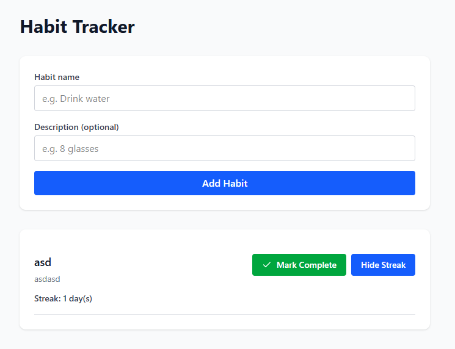

# Habit Tracker (PERN MVP)

A simple full-stack PERN habit tracker project.

## Mockup



## Live Demo

- Frontend: https://jamies-habit-tracker.onrender.com
- Backend API: https://habit-tracker-oucn.onrender.com/api
- Health Check: https://habit-tracker-oucn.onrender.com/api/health

## Tech Stack

- Frontend: React + Vite
- Backend: Node.js + Express
- Database: PostgreSQL
- Security: Helmet, CORS, environment variables
- Testing: Jest + Supertest (backend), Vitest + Testing Library (frontend)
- Deployment: Render

## Current MVP Scope

### Built

- React frontend connected to Express API
- PostgreSQL persistence with `habits` and `habit_logs`
- Create habit, list habits, mark complete for today
- Duplicate completion protection per day
- Streak endpoint and streak display in UI
- Basic security: `helmet`, CORS origin restriction, env vars
- Minimal tests: backend health route + frontend render test

### Not Yet Built

- User accounts / JWT auth
- Multi-user data isolation
- Edit/delete habits polish
- Full test coverage and CI pipeline
- Production UX polish

## Local Setup

### Prerequisites

- Node.js 18+
- PostgreSQL

### Backend

```bash
cd server
npm install
npm run dev
```

Create `server/.env`:

```env
PORT=4000
DATABASE_URL=postgresql://<user>:<password>@localhost:5432/habit_tracker
CORS_ORIGIN=http://localhost:5173
```

### Frontend

```bash
cd client
npm install
npm run dev
```

Create `client/.env`:

```env
VITE_API_URL=http://localhost:4000/api
```

## Tests

### Backend

```bash
cd server
npm test
```

### Frontend

```bash
cd client
npm test -- --run
```

## API Endpoints

- `GET /api/health`
- `GET /api/health/db`
- `GET /api/habits`
- `POST /api/habits`
- `POST /api/habits/:id/complete`
- `GET /api/habits/:id/streak`

## Notes

- This is currently a single-user MVP.
- Main next step is auth (`register/login/JWT`) and per-user data isolation.
